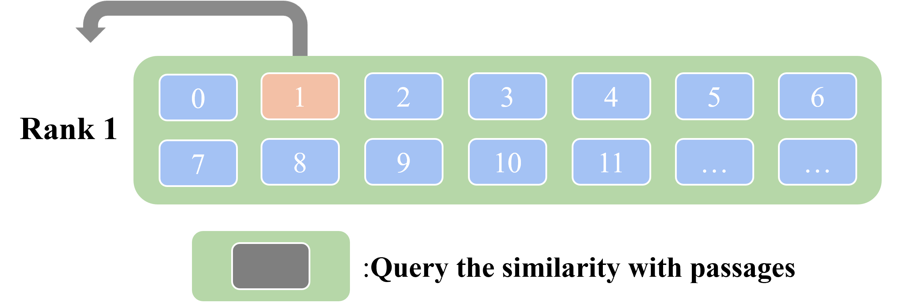

# IBRWLoss
## A Loss Weighting Algorithm Based on In-batch Positive Sample Rankings for Dense Retrievers Code Repository

This repository stores the code for the paper "A Loss Weighting Algorithm Based on In-batch Positive Sample Rankings for Dense Retrievers".

### Schematic diagram of loss weighting based on the ranking of positive document within a batch.
#### Figure (a)

On the left side are a batch of inputs for batch training, which consist of multiple queries. Each query contains one positive passage and multiple negatives. On the right side of the figure is a query and the actual negatives used for calculating its loss, that is, the samples of other queries except its own are regarded as its negatives.
#### Figure (b)

Calculate the similarity between each sample and the query, and obtain the ranking of the positive passage after sorting.
#### Figure (c)

Obtain the weights according to the weighting function. The sum of the weighted losses of each query constitutes the total loss of a batch.

## Experimental Environment
The main experimental environment we used is as follows:
- **Python Version**: 3.10
- **PyTorch Version**: 2.1.0
- **transformers Version**: 4.29.2
- **faiss-gpu Version**: 1.7.2
- **datasets Version**: 2.21.0
- **numpy Version**: 1.26.3

## 1. Data Preparation
1. **Downloading the data**:
First, you need to download the data from the Passage ranking dataset on the webpage [https://microsoft.github.io/msmarco/Datasets.html](https://microsoft.github.io/msmarco/Datasets.html). Specifically, we will use `qrels.dev.tsv`, `qrels.train.tsv`, and `qidpidtriples.train.full.2.tsv.gz`.
For the remaining data, we will directly utilize the preprocessed data of RocketQA. You can download it from [https://rocketqa.bj.bcebos.com/corpus/marco.tar.gz](https://rocketqa.bj.bcebos.com/corpus/marco.tar.gz). After downloading, please save the data to the `data/msmarco_passage/raw/` directory.
2. **Preliminary data processing**:
Once the data is downloaded and saved in the correct location, run the `data.sh` script for preliminary data processing. 

## 2. Pre-trained Model
The pre-trained model `bert-base-uncased` should be placed in the `model` directory.

## 3. Execution Steps
1. First, run `tokenize.sh`.
2. Then, run `BM25_hard.sh` to train a standard DPR.
3. Run `retrieve_training_set.sh` to retrieve the training set, preparing for the extraction of hard negative samples.
4. Run `stdDPR_hard.sh` to train and evaluate our best model.

## 4. Parameter Modification
The three weighting parameters can be modified in `tevatron/modeling.py`. 

## Experimental Details
In order to demonstrate the effectiveness of our approach, we conduct a series of experiments as follows:
#### Experiment with Vanilla Dense Retriever DPR
We carry out experiments on the vanilla dense retriever DPR with the assistance of Tevatron [cite:tevatron], which is an efficient large-scale neural retrieval tool.
- **Dataset**: We utilize the officially provided training triplet data of the MS-MARCO Passage dataset. In this dataset, the negatives are hard negatives retrieved by BM25.
- **Loss Weighting Algorithm and Parameters**: A batch-wise ranking-based loss weighting algorithm is employed. The specific parameters are set as $\alpha = 2.6$, $r = 1.8$, and $\sigma = 1.0$.
- **Training Parameters**:
    - The batch size is set to 16.
    - The learning rate is configured as $5 \times 10^{-6}$.
    - The training process runs for four epochs.
    - Constraints are applied with a maximum query length of 32 and a maximum passage length of 128.
#### Experiment with Harder Negatives
We then investigate weighted loss training with harder negatives.
- **Definition of stdDPR**: In this paper, we define the standard DPR which uses samples retrieved by BM25 as negatives as stdDPR.
- **Retrieval and Retraining**: Using stdDPR, we perform retrieval sampling on the training set to update the original negatives. Then, we retrain the model using the same parameters as mentioned before (batch size of 16, learning rate of $5 \times 10^{-6}$, four epochs, maximum query length of 32, and maximum passage length of 128) to obtain the second model.
- **Loss Weighting Parameters**: For this experiment, the loss weighting parameters are set to $\alpha = 2.8$, $r = 1.0$, and $\sigma = 2.0$.
#### Experiment with Random Negatives
Finally, to comparatively show that our method is effective beyond hard negatives, we train a third model with batch-wise random negatives.
- **Batch Size Setting**: The batch size is set to 128 to ensure that there are 127 negatives per batch, which is consistent with the prior two models.
- **Loss Weighting**: We apply loss weighting with parameters $\alpha = 2.8$, $r = 0.5$, and $\sigma = 2.0$.
Through these experiments, we aim to comprehensively evaluate the performance and effectiveness of our proposed method under different negative sampling scenarios.

## Model Performance with Different Negative Sampling Strategies on MS-MARCO and TREC Passage Datasets
The table below shows the model performance with different negative sampling strategies on MS-MARCO and TREC Passage Datasets. Best metric values in each column are in bold.
| Models | Negative | MRR@10 | Recall@50 | Recall@100 | Recall@1000 | NDCG@10 (TREC-19 Passage) | NDCG@10 (TREC-20 Passage) |
| ---- | ---- | ---- | ---- | ---- | ---- | ---- | ---- |
| DPR | Random | 23.66 | 72.56 | 80.43 | 94.95 | 56.27 | 50.16 |
| DPR+weighted | Random | 23.93 | 72.69 | 80.58 | 95.06 | 56.83 | 51.00 |
| DPR | BM25 hard | 32.38 | 79.03 | 84.96 | 95.24 | 60.31 | 63.37 |
| DPR+weighted | BM25 hard | 32.54 | 78.95 | 84.95 | 95.39 | 60.70 | 62.65 |
| DPR | stdDPR hard | 34.14 | 81.10 | 86.84 | 96.21 | 67.09 | 66.78 |
| DPR+weighted | stdDPR hard | 34.59 | 81.18 | 86.66 | 96.37 | 68.11 | 66.93 |
